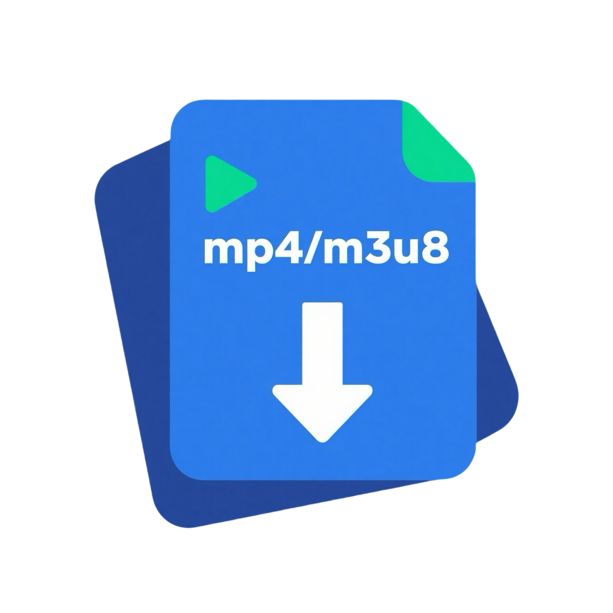

<h1>video-downloader</h1>
<h4>📖 English | <a href="https://github.com/video-resource-downloader/video-downloader/blob/master/README.md">中文</a></h4>

---

### 🎉 Aixiang Resource Downloader

> A cross-platform resource downloader built with Go + [Wails](https://github.com/wailsapp/wails).  
Clean UI, easy to use, and supports a wide range of resource sniffing and downloading.

## ✨ Features

- 🚀 **User-Friendly**: Simple operation with an intuitive and beautiful UI
- 🖥️ **Cross-Platform**: Available on Windows / macOS / Linux
- 🌐 **Supports Multiple Resource Types**: Video / Audio / Images / m3u8 / Live streams, and more
- 📱 **Wide Platform Compatibility**: Works with WeChat Channels, Mini Programs, Douyin, Kuaishou, Xiaohongshu, KuGou Music, QQ Music, and more
- 🌍 **Proxy Capture**: Built-in proxy allows fetching resources behind network restrictions

## 📚 Docs & Versions

- 📘 [Online Documentation (Chinese)](https://res.putyy.com/)
- 🧩 [Mini Version Ui Display using default browser](https://github.com/video-resource-downloader/video-downloader) ｜ [Old Electron Version Support Win7](https://github.com/video-resource-downloader/video-downloader/tree/old)
- 💬 [Join the User Group (Chinese)](https://www.putyy.com/app/admin/upload/img/20250418/6801d9554dc7.webp)
  > *If full, you can add WeChat `AmorousWorld` with a note “From GitHub”*

## 🧩 Download Links

- 🆕 [Download from GitHub](https://github.com/video-resource-downloader/video-downloader/releases)
- 🆕 [Download via Lanzou Cloud (Password: 9vs5)](https://wwjv.lanzoum.com/b04wgtfyb)
- ⚠️ *Windows 7 users: Please use version `2.3.0`*

## 🖼️ Preview

## 🚀 How to Use

> Follow these steps to use the software correctly:

1. During installation, be sure to **allow certificate installation** and **grant network access**
2. Launch the software → Click **"Start Proxy"** at the top left
3. Choose the resource types to capture (default is all)
4. Open the target content externally (WeChat, Mini App, Browser, etc.)
5. Return to the homepage to view the captured resource list

---

## ❓ FAQ

### 📺 m3u8 Video Resources

- Online Preview: [m3u8play](https://m3u8play.com/)
- Download Tool: [m3u8-down](https://m3u8-down.gowas.cn/)

### 📡 Live Stream Resources

- We recommend [OBS](https://obsproject.com/) for recording (search for setup tutorials)

### 🐢 Slow Downloads or Large File Failures?

- Recommended download managers:
    - [Neat Download Manager](https://www.neatdownloadmanager.com/index.php/en/)
    - [Motrix](https://motrix.app/download)
- For WeChat videos, click `Decrypt Video` after download

### 🧩 Unable to Intercept Resources?

- Check your system proxy settings:  
  Address: 127.0.0.1  
  Port: 8899

### 🌐 Can't Access Internet After Closing the App?

- Manually disable the system proxy settings

### 🧠 More Questions?

- [GitHub Issues](https://github.com/video-resource-downloader/video-downloader/issues)
- [Aixiang Forum Thread (Chinese)](https://s.gowas.cn/d/4089)

## 💡 Principles & Motivation

This tool captures traffic via a local proxy and filters useful resources.  
Its working principle is similar to tools like Fiddler, Charles, or browser DevTools, but with a more user-friendly display and enhanced filtering, making it suitable for everyday users with minimal tech background.

---

## ⚠️ Disclaimer

> This software is for educational and research purposes only.  
Commercial or illegal use is strictly prohibited.  
The author is not responsible for any consequences arising from misuse.
